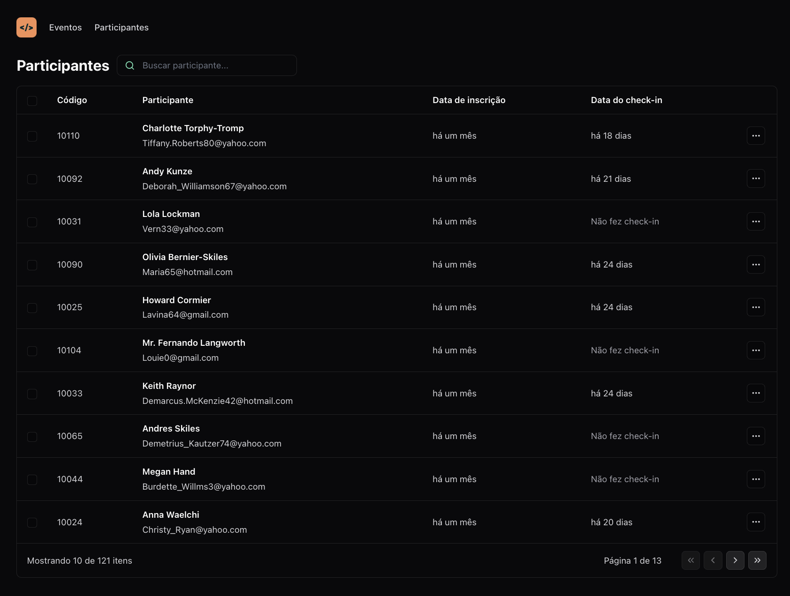

## 💻 Projeto

O pass.in é uma aplicação de **gestão de participantes em eventos presenciais**. 

Esse projeto está dividido em 2 partes:

- /web: SPA (Single Page Application) desenvolvida com React.
- /server: API desenvolvida em Node.js.

## 🧪 Tecnologias

Esse projeto foi desenvolvido com as seguintes tecnologias:

- [React](https://reactjs.org)
- [TypeScript](https://www.typescriptlang.org)
- [Node.js](https://nodejs.org)
- [Fastify] (https://fastify.dev)
- [Prisma] (https://www.prisma.io/orm)

## 🚨 Pré-requisitos

- Node.js versão 20.10.0 ou superior.

## 🚀 Como executar

### Para rodar o servidor:

1. Navegue até o diretório /server.
2. Execute `npm install` para instalar as dependências.
3. Execute `npm run db:migrate` para gerar o banco de dados SQLite.
4. Por fim, execute `npm run dev` para iniciar o servidor na porta http://localhost:3333.

### Para rodar a aplicação web:

1. Navegue até o diretório /web.
2. Execute `npm install` para instalar as dependências.
3. Execute `npm run dev` para iniciar o servidor de desenvolvimento no endereco: http://localhost:5173.

## 🧪 Testes [em desenvolvimento]:

### No servidor:

1. Navegue até o diretório /server.
2. Execute `npm run test` para rodar os testes unitários.

### Na aplicação web:

1. Navegue até o diretório /web.
2. Execute `npm run test` para rodar os testes unitários.